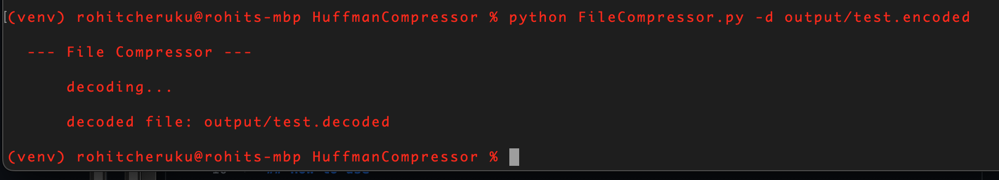

# FileCompressor
compresses/decompresses a text file using Huffman Codes to encode/decode the text 

built in python

## Prerequisites:
  - clone the repo to your machine:
    ```
    git clone https://github.com/pyR0tex/HuffmanCompressor.git
    ```
  - create a virtual environment

## To Run:
  - run the program in the command line: `python FileCompressor.py [.txt file]`
  - must use flags:` -e : encode`  `-d : decode`
  - use `python FileCompressor.py -h' for HELP`
    
```
  usage: FileCompressor.py [-h] [-e filename] [-d filename] [-t] [-c]

  compresses a text file using Huffman Codes to encode/decode the text

  optional arguments:
    -h, --help            show this help message and exit
    -e filename, --encode filename
                          -- encode the file
    -d filename, --decode filename
                          -- decode the file
    -t, --test            -- run the test suite
    -c, --clean           -- cleans the output directory
```


### Example:
  - `python FileCompressor.py -e tests/test.txt`
    
  
  - `python FileCompressor.py -d output/test.encoded`
    
